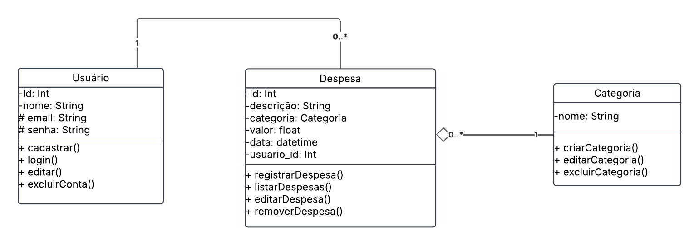
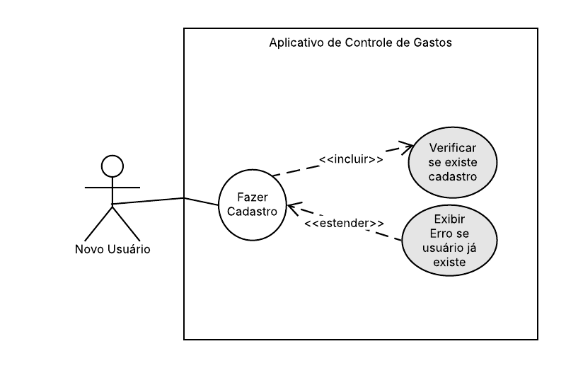
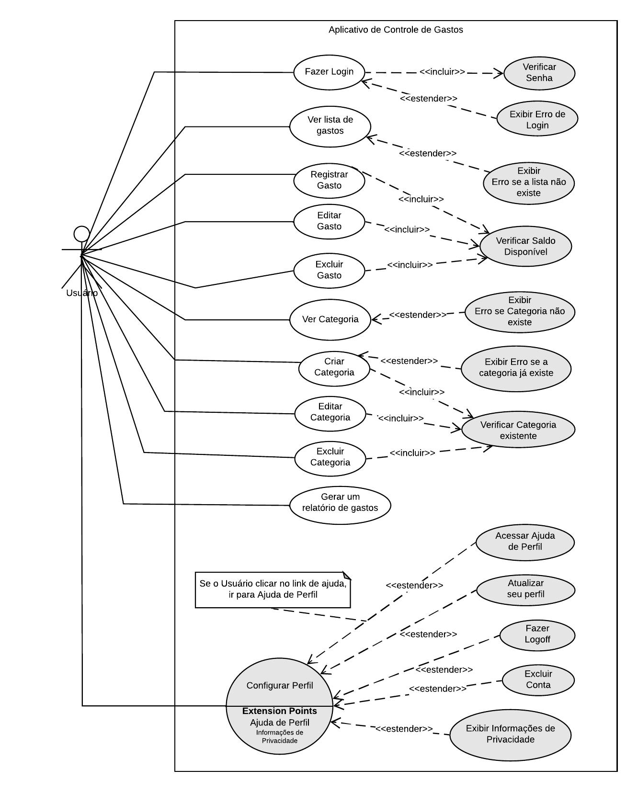
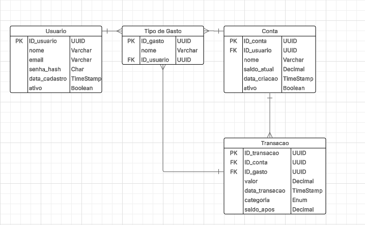

# api-despesas-python-03

# 1. Introdução:

## Descrição geral do projeto

Este projeto de gerenciamento de gastos tem como objetivo ser uma ferramenta personalizada para controle financeiro pessoal. O usuário pode registrar receitas e despesas, e categorizá-las a fim de acompanhar o fluxo de caixa.

## Funcionalidades do sistema:

- **Registro de transações**: inserção de dados como data, valor, descrição e categoria.
- **Categorização**: classificação de despesas em categorias como alimentação, transporte, lazer, etc.

## Tecnologias utilizadas:

- **Python**
- **PostgreSQL**
- **Flask**
- **SQLAchemy**
- **Flask-JWT-Extended (JWT)**

## Objetivo da API:

- Controle de gastos pessoais.

# 2. Arquitetura do Sistema:

Diagrama de Classes:

Diagrama de Caso de Uso:

# 3. Estrutura de Banco de Dados:

Diagrama de Relacionamento de Entidades:

# 4. EndPoints da API:

Documentação dos principais endpoints (incluindo método HTTP, URL, parâmetros, e exemplo de resposta).

| Método | URL                                        | Descrição          |
| ------ | ------------------------------------------ | ------------------ |
| POST   | http://localhost:5000/usuario              | Cadastra o usuário |
| GET    | http://localhost:5000/usuario              | Lista usuários     |
| PUT    | http://localhost:5000/usuario/id           | Atualiza o usuário |
| DELETE | http://localhost:5000/usuario/id           | Remove o usuário   |
| POST   | http://localhost:5000/despesa/novadespesa  | Cria nova despesa  |
| GET    | http://localhost:5000/despesa/listar       | Lista despesas     |
| PUT    | http://localhost:5000/despesa/atualizar/id | Atualiza a despesa |
| DELETE | http://localhost:5000/despesa/deletar/id   | Remove a despesa   |

# 5. Autenticação:

A API utiliza JWT(JSON Web Token) para autenticação de usuários

1. Após o login, o usuário recebe um token JWT

2. Esse token deve ser enviado no header `Authorization` nas requisições protegidas:\
`Authorization: Bearer <seu_token>`

3. No Postman, clique na aba **Authorization**

4. Em **Type**, selecione **Bearer Token**

5. Cole o token JWT no campo

6. Agora você pode fazer requisições autenticadas

# 6. Validação de Dados:

# 7. Como rodar o projeto:

1- Inicia o ambiente virtual (venv)\
`python3 -m venv venv`

2- Ativa o ambiente virtual\
Linux:\
`source venv/bin/activate`\
Windows:\
`venv/Scripts/activate`

3- Instala as dependências para o projeto\
`pip install -r requirements.txt`

4- Define a variável de ambiente FLASK_APP com o valor app.py\
`export FLASK_APP=app.py`
ou `set FLASK_APP=app.py`

5- Executa o flask\
`flask run`

6- acesse o link pelo navegador ou no Postman\
http://127.0.0.1:5000/usuario

# 8. Testes:
